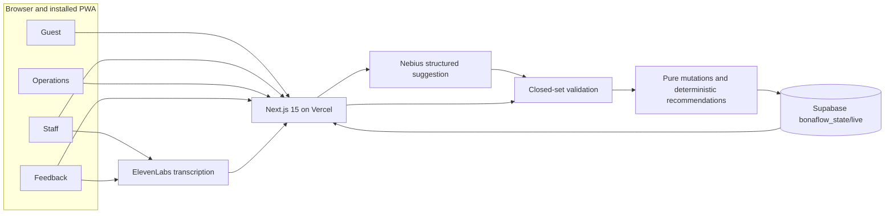

# BonaFlow

**A mobile-first live catering navigator that turns staff reports into guest guidance and operational action.**

Built for the 8x × Bella & Bona Mobile Hack at Delta Campus Berlin. BonaFlow connects four browser-based views to one shared event state, so a shortage reported on one phone changes recommendations on another within one polling interval.

[Guest](https://bonaflow.vercel.app/guest) · [Staff](https://bonaflow.vercel.app/staff) · [Operations](https://bonaflow.vercel.app/ops) · [Feedback](https://bonaflow.vercel.app/feedback) · [Two-slide deck](docs/slides/exports/bonaflow-build-approaches.pdf) · [Editable presentation](docs/slides/bonaflow-build-approaches.html)

`Next.js 15` `React 19` `TypeScript` `Supabase` `Vercel` `PWA` `Nebius` `ElevenLabs`


## Why BonaFlow

- Guests cannot see which station still has suitable food or the shorter queue.
- Staff observations stay local unless reporting is faster than finding an operations lead.
- Operations needs alerts, tasks, and redirect controls—not a passive dashboard.
- Leftover observations should inform the next event without ambiguous ratings or paid-feedback bias.

One shared event state connects Guest, Staff, Operations, and anonymous Feedback views. BonaFlow moves people during the event, then turns leftover observations into planning signals for the next one.

## One shared operational loop

1. **Report:** Staff selects a station and submits a quick action, text report, or voice note.
2. **Interpret:** A server route produces a structured model suggestion or a deterministic keyword fallback.
3. **Validate:** Application code rejects unknown station or dish IDs, invalid enum values, and ineligible alternatives.
4. **Apply:** Pure TypeScript functions update station status, alerts, tasks, counters, and eligible recommendations before the repository persists the next state.
5. **Synchronize:** Guest and Operations views receive the shared state on the next three-second poll.

Feedback is deliberately isolated from that loop. Anonymous leftover observations append to a separate `feedback` array; the feedback route verifies that no operational field changed, and submission never unlocks a redirect or incentive.

## Architecture



**Nebius proposes; application code validates and decides.** ElevenLabs and Nebius are called only from server routes and never write operational state directly.

## Engineering decisions

| Decision | Why it matters |
| --- | --- |
| **Model proposes; code decides** | Structured model output is only a suggestion. Deterministic code owns validation, eligibility, and state changes. |
| **Closed-set validation** | Station IDs, dish IDs, and enumerations must exist in the current state; invented values are rejected. |
| **Pure mutation functions** | State transitions clone their input and return a next state, making operational behavior predictable and independently testable. |
| **Repository boundary** | Persistence sits behind one interface: Supabase supports cross-device state, while a non-durable memory repository keeps local development usable. |
| **Polling over sockets** | A three-second polling loop is simple, observable, and recovers naturally on unreliable event Wi-Fi. The last successful state remains visible when a poll fails. |
| **Graceful degradation** | Text input is always available. Missing model credentials use deterministic interpretation; unavailable voice keeps the visible text path. |
| **Feedback isolation** | Feedback adds anonymous leftover facts only. It cannot modify stations, alerts, tasks, redirects, or incentives. |
| **Server-only secrets** | Supabase service-role and provider keys are read only inside server code and are never shipped to the browser. |

## Product surfaces

<table>
  <thead>
    <tr>
      <th align="center">Guest</th>
      <th align="center">Staff</th>
      <th align="center">Operations</th>
      <th align="center">Feedback</th>
    </tr>
  </thead>
  <tbody>
    <tr>
      <td align="center"></td>
      <td align="center"></td>
      <td align="center"></td>
      <td align="center"></td>
    </tr>
    <tr>
      <td><strong>Dietary fit and live guidance.</strong> Availability, queues, eligible redirects, and announcements.</td>
      <td><strong>Fast, accountable reporting.</strong> One-tap actions plus editable voice or text confirmation.</td>
      <td><strong>A live floor view.</strong> Stations, alerts, replenishment tasks, redirect control, and leftover signals.</td>
      <td><strong>Unbiased menu signals.</strong> Anonymous leftover amount and reason capture with no rating or reward.</td>
    </tr>
  </tbody>
</table>

## From prototype to distribution


The first approach explored a native-style app with Bilt; the final demo moved to a React PWA when frictionless distribution became the decisive requirement. The prototype remains preserved on the separate [`archive/bilt-app`](https://github.com/kaiser-data/bonaflow/tree/archive/bilt-app) branch—none of its runtime code is merged into `main`.

- **Bilt accelerated prototyping:** beginner-friendly natural-language building, integrated backend work, and a polished native experience out of the box.
- **The preview barrier mattered:** opening the prototype still required Expo Go, which added an install step for an audience standing in front of a QR code.
- **The PWA optimized reach:** React required more engineering, but Vercel deployment made the same link open immediately in a mobile browser and remain installable as a PWA.

## Technology stack

| Layer | Technology | Responsibility |
| --- | --- | --- |
| Interface | Next.js 15, React 19, TypeScript, Tailwind CSS 4 | Mobile-first routes, reusable components, responsive styling |
| Server | Next.js route handlers, Zod | Secret-safe provider calls, request handling, schema validation |
| State transitions | Pure TypeScript domain functions | Deterministic mutations, reset behavior, and eligible recommendations |
| Persistence | Supabase Postgres JSON state | Shared `bonaflow_state/live` record across devices |
| AI interpretation | Nebius through an OpenAI-compatible client | Strict structured suggestions for staff reports and leftover feedback |
| Voice | ElevenLabs | Speech-to-text and bilingual announcement audio |
| Delivery | GitHub, Vercel, PWA manifest and service worker | Deployment, QR-to-browser access, installation, and offline shell |
| Verification | Vitest, TypeScript, Next.js production build | Focused domain tests and release checks |

## Try the live demo

| View | Live route | Purpose |
| --- | --- | --- |
| Guest | [bonaflow.vercel.app/guest](https://bonaflow.vercel.app/guest) | Find suitable available dishes, compare queues, and follow live redirects. |
| Staff | [bonaflow.vercel.app/staff](https://bonaflow.vercel.app/staff) | Report shortages, queues, closures, or resolutions with quick actions, text, or voice. |
| Operations | [bonaflow.vercel.app/ops](https://bonaflow.vercel.app/ops) | Monitor the floor, resolve tasks, control redirects, review leftovers, and reset the demo. |
| Feedback | [bonaflow.vercel.app/feedback](https://bonaflow.vercel.app/feedback) | Submit anonymous leftover amount and reason data without a score or incentive. |

Scan to open the canonical Guest route:

<p align="center">
  
</p>

### Cross-device acceptance flow

1. Open Guest on one phone and Staff on another.
2. In Staff, select **Atrium → Item sold out → Vegan Chickpeas Quinoa Salad**.
3. Within one polling interval, the untouched Guest phone shows Atrium red and recommends Terrace.
4. Operations shows the corresponding alert and replenishment task.
5. Use **Operations → Reset demo data** when finished.

## Run locally

1. Run [`supabase/setup.sql`](supabase/setup.sql) in the Supabase SQL editor.
2. Copy `.env.example` to `.env.local`.
3. Add the required Supabase values and any optional provider credentials.
4. Install and start the application:

   ```bash
   npm install
   npm run dev
   ```

5. Open [http://localhost:3000/guest](http://localhost:3000/guest).

| Variable | Requirement | Responsibility |
| --- | --- | --- |
| `SUPABASE_URL` | Required for shared persistence | Supabase project endpoint |
| `SUPABASE_SERVICE_ROLE_KEY` | Required for shared persistence; server only | Reads and writes the single live state record |
| `NEBIUS_API_KEY` | Optional | Enables structured model interpretation; deterministic fallback is used without it |
| `LM_MODEL` | Optional | Overrides the configured Qwen model used through the Nebius endpoint |
| `ELEVENLABS_API_KEY` | Optional | Enables transcription and announcement audio; visible text remains available without it |
| `ELEVENLABS_VOICE_ID` | Optional | Selects the announcement voice |

If either Supabase variable is missing, the server uses a non-durable in-memory repository that may reset between serverless invocations. It is useful for local exploration, not cross-device deployment.

## Verification

```bash
npm test
npm run typecheck
npm run build
```

The deliberately small Vitest suite protects the four demo-critical domain behaviors:

- closed-set validation rejects invented station or dish IDs;
- applying a report updates status, alert, task, and counter in sequence;
- reset restores the seed state exactly;
- recommendation ranking prefers the lower queue and excludes the current station.

Type checking and the production build cover the application boundary around those rules.

## Deployment

`main` is connected from GitHub to Vercel. A push triggers the Next.js deployment; Vercel provides the canonical browser routes and installable PWA shell, while Supabase holds the shared event state.

Configure the same environment names from `.env.example` in Vercel project settings. Keep the Supabase service-role key and optional Nebius and ElevenLabs credentials server-only—never commit `.env.local`, provider keys, or deployment tokens. After changing the canonical domain, regenerate `public/guest-qr.png`:

```bash
npx qrcode -o public/guest-qr.png -w 1200 -m 2 "https://bonaflow.vercel.app/guest"
```

## Repository map

```text
src/app/             Routes and server handlers
src/components/      Reusable interface units
src/domain/          Types, validation, recommendations, mutations, and seed data
src/hooks/           Cross-device state polling
src/server/          Persistence and provider adapters
supabase/setup.sql   Database bootstrap
docs/slides/         Presentation source, screenshots, and exports
public/              PWA icons, dish images, service worker, and production QR
archive/bilt-app     Separate Git branch containing the Bilt prototype
```

## Current limitations

- This is a hackathon prototype with one shared event state and no authentication or role authorization.
- Station layout, queue levels, availability, and operations data are simulated for the demo.
- Provider-assisted features depend on optional credentials and fall back to deterministic interpretation or visible text.
- The JSON state record is intentionally simple; it is not yet a multi-event relational operations model.

## Roadmap

- Add authenticated staff and operations roles with tenant-specific events.
- Move from one live blob to event history, audit records, and concurrency-aware writes.
- Expand leftover and traffic analytics into planning recommendations across events.
- Validate PWA adoption before considering native App Store and Google Play packaging.

---

Independent hackathon prototype. Not affiliated with Bella & Bona. Dish names and allergens were transcribed from bowl labels on 1 Aug; confirm allergens with catering staff.
