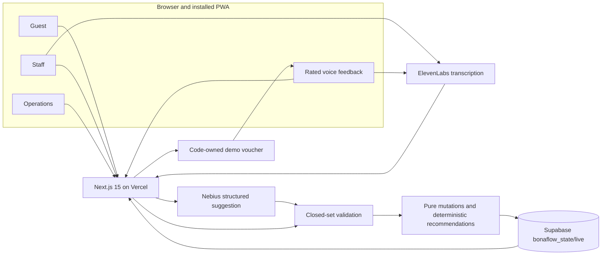
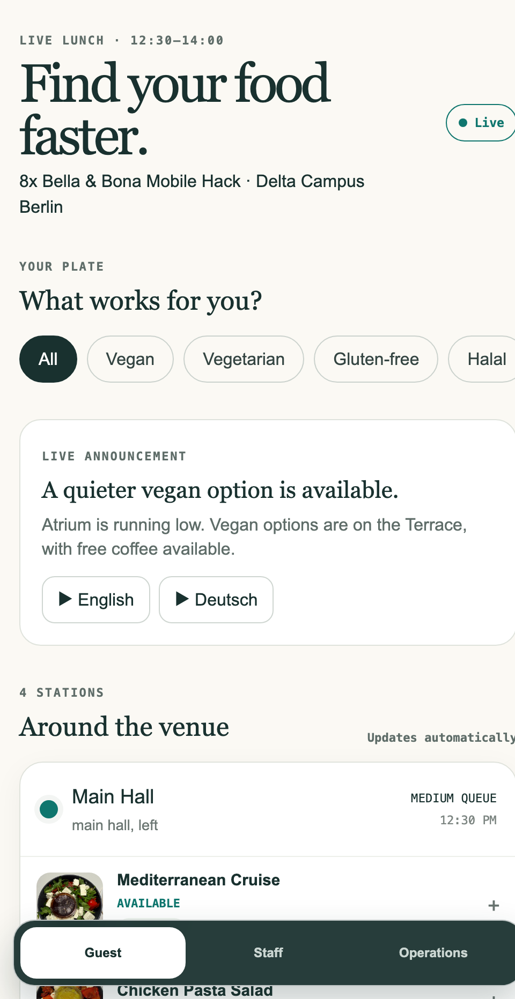
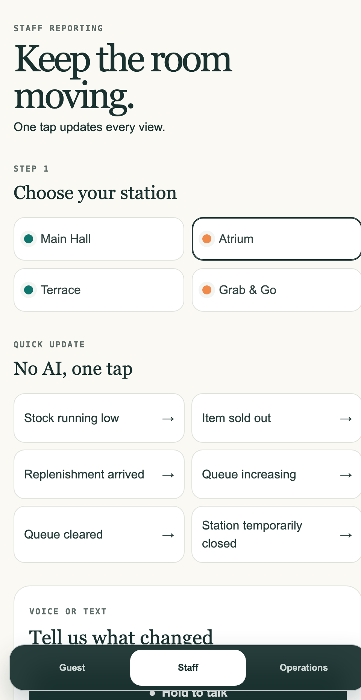
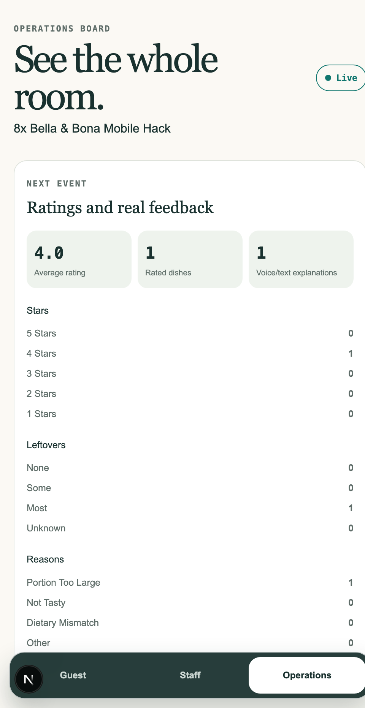
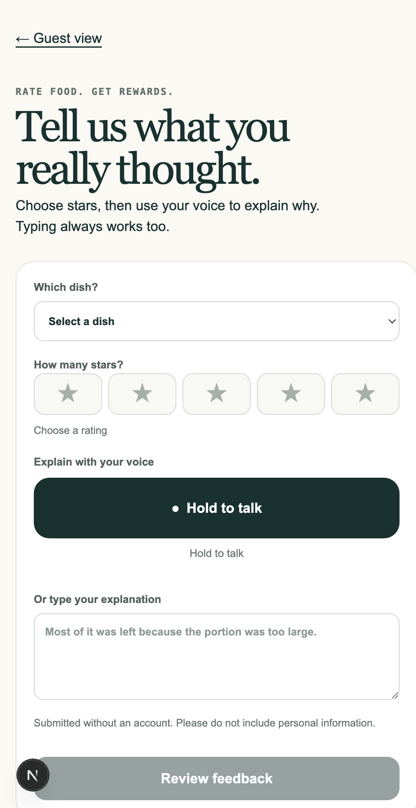
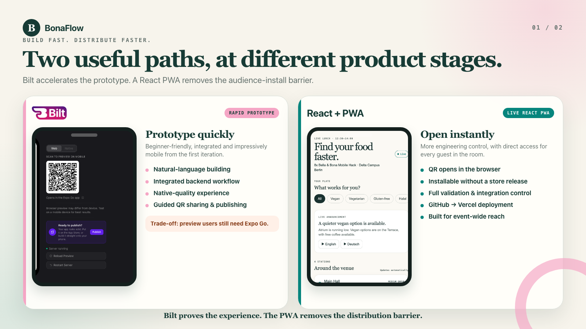

# BonaFlow

**RATE FOOD. GET REWARDS.**

Built for the 8x × Bella & Bona Mobile Hack at Delta Campus Berlin. BonaFlow combines direct 1–5 star ratings with voice explanations, turns real meal feedback into menu signals, and returns an instant demo voucher after a valid response is saved. The same PWA also connects Guest, Staff, and Operations views to one live event state.

[Guest](https://bonaflow.vercel.app/guest) · [Staff](https://bonaflow.vercel.app/staff) · [Operations](https://bonaflow.vercel.app/ops) · [Feedback](https://bonaflow.vercel.app/feedback) · [Two-slide deck](docs/slides/exports/bonaflow-build-approaches.pdf) · [Editable presentation](docs/slides/bonaflow-build-approaches.html)

`Next.js 15` `React 19` `TypeScript` `Supabase` `Vercel` `PWA` `Nebius` `ElevenLabs`


## Why BonaFlow

- Guests cannot see which station still has suitable food or the shorter queue.
- Staff observations stay local unless reporting is faster than finding an operations lead.
- Operations needs alerts, tasks, and redirect controls—not a passive dashboard.
- A star alone cannot explain *why* food was left; voice or text adds the operationally useful reason.

One shared event state connects Guest, Staff, Operations, and Feedback views. BonaFlow moves people during the event, then combines comparable ratings with guests’ own words to improve the next one.

## One shared operational loop

1. **Report:** Staff selects a station and submits a quick action, text report, or voice note.
2. **Interpret:** A server route produces a structured model suggestion or a deterministic keyword fallback.
3. **Validate:** Application code rejects unknown station or dish IDs, invalid enum values, and ineligible alternatives.
4. **Apply:** Pure TypeScript functions update station status, alerts, tasks, counters, and eligible recommendations before the repository persists the next state.
5. **Synchronize:** Guest and Operations views receive the shared state on the next three-second poll.

The reward path is deliberately isolated from operations. A guest selects a dish and stars directly, then explains the rating by voice or text. Nebius suggests a leftover interpretation, code validates it, and the API appends a rated feedback record. Only after Supabase persistence succeeds does application code return the fixed `BONAFLOW-DEMO` voucher. The write cannot change stations, alerts, tasks, recommendations, or the separate operations-controlled redirect incentive.

## Architecture



**Nebius proposes; application code validates and decides.** The star value is direct guest input, and the voucher definition is owned by code. ElevenLabs and Nebius are called only from server routes and never write operational state or choose a reward.

## Engineering decisions

| Decision | Why it matters |
| --- | --- |
| **Model proposes; code decides** | Structured model output is only a suggestion. Deterministic code owns validation, eligibility, and state changes. |
| **Closed-set validation** | Station IDs, dish IDs, and enumerations must exist in the current state; invented values are rejected. |
| **Pure mutation functions** | State transitions clone their input and return a next state, making operational behavior predictable and independently testable. |
| **Repository boundary** | Persistence sits behind one interface: Supabase supports cross-device state, while a non-durable memory repository keeps local development usable. |
| **Polling over sockets** | A three-second polling loop is simple, observable, and recovers naturally on unreliable event Wi-Fi. The last successful state remains visible when a poll fails. |
| **Graceful degradation** | Text input is always available. Missing model credentials use deterministic interpretation; unavailable voice keeps the visible text path. |
| **Feedback isolation** | Rated feedback appends one record and returns a fixed voucher only after persistence. It cannot modify stations, alerts, tasks, redirects, or incentives. |
| **Voice explains the score** | Stars create a comparable distribution; required voice or text preserves the guest’s reason instead of asking Operations to guess. |
| **Server-only secrets** | Supabase service-role and provider keys are read only inside server code and are never shipped to the browser. |

## Product surfaces

<table>
  <thead>
    <tr>
      <th align="center">Guest</th>
      <th align="center">Staff</th>
      <th align="center">Operations</th>
      <th align="center">Feedback</th>
    </tr>
  </thead>
  <tbody>
    <tr>
      <td align="center"></td>
      <td align="center"></td>
      <td align="center"></td>
      <td align="center"></td>
    </tr>
    <tr>
      <td><strong>Dietary fit and live guidance.</strong> Availability, queues, eligible redirects, and announcements.</td>
      <td><strong>Fast, accountable reporting.</strong> One-tap actions plus editable voice or text confirmation.</td>
      <td><strong>A live floor view.</strong> Stations, alerts, tasks, redirect control, star distribution, reasons, and leftovers.</td>
      <td><strong>Rate food. Explain why.</strong> Direct stars plus required voice/text feedback and an instant demo voucher.</td>
    </tr>
  </tbody>
</table>

## From prototype to distribution



The first approach explored a native-style app with Bilt; the final demo moved to a React PWA when frictionless distribution became the decisive requirement. The prototype remains preserved on the separate [`archive/bilt-app`](https://github.com/kaiser-data/bonaflow/tree/archive/bilt-app) branch—none of its runtime code is merged into `main`.

- **Bilt accelerated prototyping:** beginner-friendly natural-language building, integrated backend work, and a polished native experience out of the box.
- **The preview barrier mattered:** opening the prototype still required Expo Go, which added an install step for an audience standing in front of a QR code.
- **The PWA optimized reach:** React required more engineering, but Vercel deployment made the same link open immediately in a mobile browser and remain installable as a PWA.

## Technology stack

| Layer | Technology | Responsibility |
| --- | --- | --- |
| Interface | Next.js 15, React 19, TypeScript, Tailwind CSS 4 | Mobile-first routes, reusable components, responsive styling |
| Server | Next.js route handlers, Zod | Secret-safe provider calls, request handling, schema validation |
| State transitions | Pure TypeScript domain functions | Deterministic mutations, reset behavior, and eligible recommendations |
| Persistence | Supabase Postgres JSON state | Shared `bonaflow_state/live` record across devices |
| AI interpretation | Nebius through an OpenAI-compatible client | Strict leftover suggestions; never infers stars or selects rewards |
| Voice | ElevenLabs | Speech-to-text and bilingual announcement audio |
| Delivery | GitHub, Vercel, PWA manifest and service worker | Deployment, QR-to-browser access, installation, and offline shell |
| Verification | Vitest, TypeScript, Next.js production build | Focused domain tests and release checks |

## Try the live demo

| View | Live route | Purpose |
| --- | --- | --- |
| Guest | [bonaflow.vercel.app/guest](https://bonaflow.vercel.app/guest) | Find suitable available dishes, compare queues, and follow live redirects. |
| Staff | [bonaflow.vercel.app/staff](https://bonaflow.vercel.app/staff) | Report shortages, queues, closures, or resolutions with quick actions, text, or voice. |
| Operations | [bonaflow.vercel.app/ops](https://bonaflow.vercel.app/ops) | Monitor the floor, resolve tasks, control redirects, review leftovers, and reset the demo. |
| Feedback | [bonaflow.vercel.app/feedback](https://bonaflow.vercel.app/feedback) | Rate a dish, explain it by voice or text, and receive the fixed demo voucher after persistence. |

Choose a journey:

<table>
  <thead><tr><th align="center">Rate + reward</th><th align="center">Live station guide</th></tr></thead>
  <tbody>
    <tr>
      <td align="center"></td>
      <td align="center"></td>
    </tr>
    <tr><td align="center"><code>/feedback</code></td><td align="center"><code>/guest</code></td></tr>
  </tbody>
</table>

### Rated-feedback acceptance flow

1. Scan **Rate + reward**, select a closed-list dish, and choose 1–5 stars.
2. Record a voice explanation or use the typed alternative; at least five characters are required.
3. Review the plain interpretation sentence. The selected stars remain direct guest input.
4. Confirm the feedback. After persistence, the app displays code **`BONAFLOW-DEMO`** for a free demo coffee on the Terrace.
5. Refresh to see the event-scoped voucher restored in the same browser.

### Cross-device acceptance flow

1. Open Guest on one phone and Staff on another.
2. In Staff, select **Atrium → Item sold out → Vegan Chickpeas Quinoa Salad**.
3. Within one polling interval, the untouched Guest phone shows Atrium red and recommends Terrace.
4. Operations shows the corresponding alert and replenishment task.
5. Use **Operations → Reset demo data** when finished.

## Run locally

1. Run [`supabase/setup.sql`](supabase/setup.sql) in the Supabase SQL editor.
2. Copy `.env.example` to `.env.local`.
3. Add the required Supabase values and any optional provider credentials.
4. Install and start the application:

   ```bash
   npm install
   npm run dev
   ```

5. Open [http://localhost:3000/guest](http://localhost:3000/guest).

| Variable | Requirement | Responsibility |
| --- | --- | --- |
| `SUPABASE_URL` | Required for shared persistence | Supabase project endpoint |
| `SUPABASE_SERVICE_ROLE_KEY` | Required for shared persistence; server only | Reads and writes the single live state record |
| `NEBIUS_API_KEY` | Optional | Enables structured model interpretation; deterministic fallback is used without it |
| `LM_MODEL` | Optional | Overrides the configured Qwen model used through the Nebius endpoint |
| `ELEVENLABS_API_KEY` | Optional | Enables transcription and announcement audio; visible text remains available without it |
| `ELEVENLABS_VOICE_ID` | Optional | Selects the announcement voice |

If either Supabase variable is missing, the server uses a non-durable in-memory repository that may reset between serverless invocations. It is useful for local exploration, not cross-device deployment.

## Verification

```bash
npm test
npm run typecheck
npm run build
```

The focused Vitest suite currently protects 14 demo-critical behaviors across four files, including:

- closed-set validation rejects invented station or dish IDs;
- applying a report updates status, alert, task, and counter in sequence;
- reset restores the seed state exactly;
- recommendation ranking prefers the lower queue and excludes the current station;
- ratings accept only integer values from one through five and require a substantive explanation;
- rated feedback changes only the feedback collection;
- voucher construction and browser restoration fail safely;
- persistence failure returns no reward result; and
- Operations averages only valid ratings while retaining legacy leftover/reason signals.

Type checking and the production build cover the application boundary around those rules.

## Deployment

`main` is connected from GitHub to Vercel. A push triggers the Next.js deployment; Vercel provides the canonical browser routes and installable PWA shell, while Supabase holds the shared event state.

Configure the same environment names from `.env.example` in Vercel project settings. Keep the Supabase service-role key and optional Nebius and ElevenLabs credentials server-only—never commit `.env.local`, provider keys, or deployment tokens. After changing the canonical domain, regenerate both QR assets:

```bash
npx qrcode -o public/guest-qr.png -w 1200 -m 2 "https://bonaflow.vercel.app/guest"
npx qrcode -o public/feedback-qr.png -w 1200 -m 2 "https://bonaflow.vercel.app/feedback"
```

## Repository map

```text
src/app/             Routes and server handlers
src/components/      Reusable interface units
src/domain/          Types, validation, recommendations, mutations, and seed data
src/hooks/           Cross-device state polling
src/server/          Persistence and provider adapters
supabase/setup.sql   Database bootstrap
docs/slides/         Presentation source, screenshots, and exports
public/              PWA icons, dish images, service worker, and production QR
archive/bilt-app     Separate Git branch containing the Bilt prototype
```

## Current limitations

- This is a hackathon prototype with one shared event state and no authentication or role authorization.
- Station layout, queue levels, availability, and operations data are simulated for the demo.
- Provider-assisted features depend on optional credentials and fall back to deterministic interpretation or visible text.
- The JSON state record is intentionally simple; it is not yet a multi-event relational operations model.
- The voucher is a hackathon demo reward. One-per-event limiting uses browser storage and can be bypassed by clearing site data or calling the endpoint directly; it is not production fraud prevention.

## Roadmap

- Add authenticated staff and operations roles with tenant-specific events.
- Move from one live blob to event history, audit records, and concurrency-aware writes.
- Expand leftover and traffic analytics into planning recommendations across events.
- Add authenticated reward campaigns, unique codes, redemption status, and abuse controls if user validation supports the model.
- Validate PWA adoption before considering native App Store and Google Play packaging.

---

Independent hackathon prototype. Not affiliated with Bella & Bona. Dish names and allergens were transcribed from bowl labels on 1 Aug; confirm allergens with catering staff.
