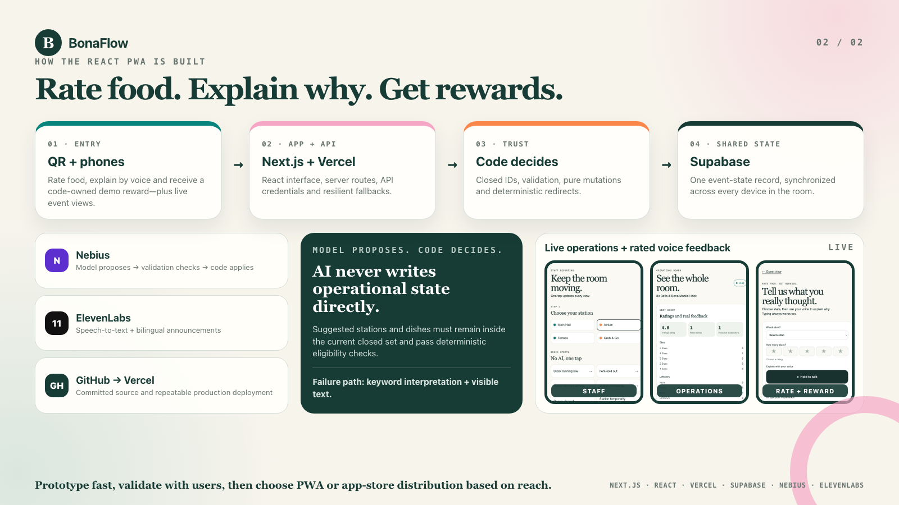

# BonaFlow portfolio media

Post-ready visuals are separated from runtime assets and ordered for quick reuse.

## LinkedIn carousel

The six files in [`linkedin/`](linkedin/) tell the story in sequence:

1. [Product promise and architecture](linkedin/01-rate-food-get-rewards-architecture.png)
2. [Voice-first feedback experience](linkedin/02-voice-rating-feedback.png)
3. [Operations analytics](linkedin/03-operations-rating-analytics.png)
4. [Bilt prototype to React PWA](linkedin/04-prototype-to-pwa.png)
5. [Bella & Bona event context](linkedin/05-event-meal-branded.jpeg)
6. [Meal close-up](linkedin/06-event-meal-closeup.jpeg)

## Event photography

The original hackathon meal photographs are preserved in [`event-photos/`](event-photos/) with descriptive, ordered filenames. The LinkedIn copies remain byte-identical to their source images.

Runtime screenshots used by the app and presentation remain under [`public/`](../../public/) and [`docs/slides/assets/`](../../docs/slides/assets/).
