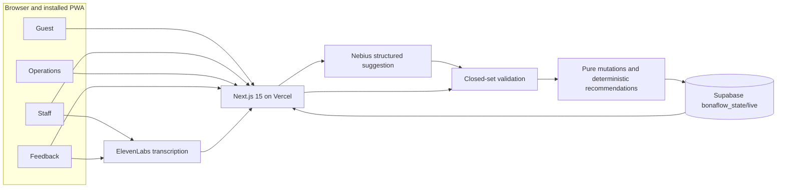

# BonaFlow Portfolio README Implementation Plan

> **For agentic workers:** REQUIRED SUB-SKILL: Use superpowers:subagent-driven-development (recommended) or superpowers:executing-plans to implement this plan task-by-task. Steps use checkbox (`- [ ]`) syntax for tracking.

**Goal:** Replace the minimal README with a visual portfolio case study explaining BonaFlow's product value, cross-device workflow, infrastructure, trust model, prototype-to-PWA decision, live demo, and developer handoff.

**Architecture:** Keep implementation isolated to `README.md`. Reuse repository-relative screenshots, slide exports, and the production QR; express infrastructure with GitHub-compatible Mermaid and concise prose; verify every claim against current source and configuration. Do not add artwork, dependencies, application changes, or external badge images.

**Tech Stack:** GitHub-flavored Markdown, embedded HTML image/table elements, Mermaid, repository-relative PNG assets, shell-based content validation, Git.

## Global Constraints

- Primary audience: portfolio visitors and technical recruiters.
- Lead with outcomes and engineering judgment; put setup later.
- Modify only `README.md` during implementation.
- Use committed assets under `docs/slides/` and `public/guest-qr.png`.
- Use relative images, meaningful alt text, and text-only inline-code badges.
- Keep raw mobile screenshots between 180 and 230 pixels wide and display each once.
- Keep `origin/archive/bilt-app` unchanged and describe it only as separate prototype history.
- Do not describe ratings, rewards, scores, or vouchers as final-product features.
- Do not claim optional provider credentials are active; document safe fallbacks.
- Do not expose credentials, mutate production state, add packages, or change deployment configuration.

---

## File Map

- Modify `README.md`: complete portfolio story, architecture, live demo, setup, verification, limitations, and roadmap.
- Read only `package.json` and `.env.example`: stack, scripts, and environment contract.
- Read only `src/domain/`, `src/server/`, `src/app/api/`, and `src/hooks/`: validate system claims.
- Read only `docs/slides/` and `public/guest-qr.png`: validate visual assets.

---

### Task 1: Verify every source fact before writing

**Files:**
- Read: `package.json`
- Read: `.env.example`
- Read: `src/domain/types.ts`
- Read: `src/domain/validation.ts`
- Read: `src/domain/mutations.ts`
- Read: `src/domain/recommendations.ts`
- Read: `src/server/state-repository.ts`
- Read: `src/server/nebius.ts`
- Read: `src/server/nebius-feedback.ts`
- Read: `src/app/api/transcribe/route.ts`
- Read: `src/app/api/announcements/route.ts`
- Read: `src/hooks/use-live-state.ts`

**Interfaces:**
- Consumes: committed application architecture and configuration.
- Produces: a verified fact checklist for Task 2; no writes.

- [ ] **Step 1: Verify runtime and scripts**

Run:

```bash
node -e 'const p=require("./package.json"); console.log(JSON.stringify({scripts:p.scripts,dependencies:p.dependencies,devDependencies:p.devDependencies},null,2))'
```

Expected evidence: Next.js 15, React 19, TypeScript, Supabase JS, OpenAI-compatible client, Zod, QR generation, Tailwind CSS 4, and Vitest scripts.

- [ ] **Step 2: Verify environment names**

Run:

```bash
sed -n '1,120p' .env.example
rg -n "process\.env\.[A-Z0-9_]+" src | sort
```

Expected names: `SUPABASE_URL`, `SUPABASE_SERVICE_ROLE_KEY`, `NEBIUS_API_KEY`, `LM_MODEL`, `ELEVENLABS_API_KEY`, and `ELEVENLABS_VOICE_ID`.

- [ ] **Step 3: Verify trust and data-flow claims**

Run:

```bash
rg -n "validateExtraction|applyExtraction|buildRecommendations|recommendStation|feedback|structuredClone|memoryState|AbortSignal.timeout|setInterval" src/domain src/server src/app/api src/hooks
```

Confirm: current-state ID/enumeration validation; cloned pure mutations; queue-ranked eligible recommendations; Supabase `bonaflow_state/live` plus memory fallback; provider timeouts and deterministic fallback; isolated feedback append; three-second polling with last-known state.

- [ ] **Step 4: Verify visuals, branch, and live deployment**

Run:

```bash
file docs/slides/assets/react-guest.png docs/slides/assets/react-staff.png docs/slides/assets/react-ops.png docs/slides/assets/react-feedback.png docs/slides/exports/slide-1.png docs/slides/exports/slide-2.png public/guest-qr.png
git rev-parse origin/archive/bilt-app
curl -fsS https://bonaflow.vercel.app/api/state
```

Expected: seven valid PNGs, Bilt commit `c14c57357773feca070924661ac4ad85dc9ae4b4`, and a successful read-only state response. Never call a mutation endpoint.

---

### Task 2: Rewrite README.md as a portfolio case study

**Files:**
- Modify: `README.md`

**Interfaces:**
- Consumes: Task 1 facts and committed visual assets.
- Produces: a self-contained GitHub portfolio page.

- [ ] **Step 1: Write the hero and live links**

Start with:

```markdown
# BonaFlow

**A mobile-first live catering navigator that turns staff reports into guest guidance and operational action.**

Built for the 8x × Bella & Bona Mobile Hack at Delta Campus Berlin. BonaFlow connects four browser-based views to one shared event state, so a shortage reported on one phone changes recommendations on another within one polling interval.

[Guest](https://bonaflow.vercel.app/guest) · [Staff](https://bonaflow.vercel.app/staff) · [Operations](https://bonaflow.vercel.app/ops) · [Feedback](https://bonaflow.vercel.app/feedback) · [Two-slide deck](docs/slides/exports/bonaflow-build-approaches.pdf)

`Next.js 15` `React 19` `TypeScript` `Supabase` `Vercel` `PWA` `Nebius` `ElevenLabs`
```

Add a centered HTML row with Guest and Operations images at width `220`, descriptive alt text, and relative paths.

- [ ] **Step 2: Explain the problem and shared loop**

Create `## Why BonaFlow` with four short problem bullets and this outcome:

```text
One shared event state connects Guest, Staff, Operations, and anonymous Feedback views. BonaFlow moves people during the event, then turns leftover observations into planning signals for the next one.
```

Create `## One shared operational loop` with five numbered steps: staff input; model or deterministic interpretation; closed-set validation; pure state mutation; three-second cross-device polling. Follow with a separate feedback-isolation paragraph.

- [ ] **Step 3: Add architecture and infrastructure**

Create `## Architecture`, embed `docs/slides/exports/slide-2.png`, and add:



State immediately below: `Nebius proposes; application code validates and decides. ElevenLabs and Nebius are called only from server routes and never write operational state directly.`

- [ ] **Step 4: Add the engineering-decision table**

Create `## Engineering decisions` with one concise why-it-matters row for: model proposes/code decides; closed-set validation; pure mutation functions; repository boundary; polling over sockets; graceful degradation; feedback isolation; server-only secrets.

- [ ] **Step 5: Add the four-screen gallery**

Create `## Product surfaces` as a four-column HTML table. Use width `200` and these paths exactly once:

```text
docs/slides/assets/react-guest.png
docs/slides/assets/react-staff.png
docs/slides/assets/react-ops.png
docs/slides/assets/react-feedback.png
```

Captions: Guest — diets/availability/queues/redirects/announcements; Staff — one-tap plus editable voice/text confirmation; Operations — live floor/alerts/tasks/incentive/leftovers; Feedback — anonymous leftover amount/reason with no rating or reward.

- [ ] **Step 6: Add the prototype-to-distribution lesson**

Create `## From prototype to distribution`, embed `docs/slides/exports/slide-1.png`, and keep prose to one paragraph plus three bullets. Explain Bilt's prototyping/backend/native strengths, the Expo Go preview barrier, and the React PWA's QR-to-browser/Vercel distribution. Link the separate branch at `https://github.com/kaiser-data/bonaflow/tree/archive/bilt-app`. Do not discuss Bilt's early rating/reward behavior.

- [ ] **Step 7: Add the responsibility-based stack table**

Create `## Technology stack` with rows for Interface, Server, State transitions, Persistence, AI interpretation, Voice, Delivery, and Verification. Name the actual technologies and their responsibilities; avoid logo marketing.

- [ ] **Step 8: Add routes, QR, and acceptance flow**

Create `## Try the live demo` with role/URL/purpose rows for `/guest`, `/staff`, `/ops`, and `/feedback`. Display the QR using:

```html
<p align="center">
  
</p>
```

Add the exact Atrium sold-out cross-device flow and Operations reset step without invoking it.

- [ ] **Step 9: Add setup, verification, and deployment**

Create `## Run locally`, `## Verification`, and `## Deployment`. Setup uses `supabase/setup.sql`, `.env.example`, `npm install`, and `npm run dev`. Include all six verified variables and mark provider keys optional. Show `npm test`, `npm run typecheck`, and `npm run build`, then describe the four deliberately scoped domain tests. Deployment explains GitHub → Vercel and server-only environment configuration without secrets.

- [ ] **Step 10: Add repository map, limitations, roadmap, and disclaimer**

Create `## Repository map`, `## Current limitations`, and `## Roadmap` using the approved spec. End with:

```text
Independent hackathon prototype. Not affiliated with Bella & Bona. Dish names and allergens were transcribed from bowl labels on 1 Aug; confirm allergens with catering staff.
```

- [ ] **Step 11: Inspect hierarchy and duplication**

Run:

```bash
sed -n '1,460p' README.md
rg -n '^#{1,3} ' README.md
```

Expected: one H1, specified H2 order, no long unbroken paragraphs, and each raw screenshot path only once.

---

### Task 3: Validate and commit the README-only change

**Files:**
- Verify: `README.md`
- Verify unchanged: `src/`, `public/`, `package.json`, `package-lock.json`, `supabase/`, and `origin/archive/bilt-app`

**Interfaces:**
- Consumes: completed README and committed repository.
- Produces: evidence of accuracy, valid assets/links, isolation, and a clean commit.

- [ ] **Step 1: Verify all relative image files**

Run:

```bash
for path in docs/slides/assets/react-guest.png docs/slides/assets/react-staff.png docs/slides/assets/react-ops.png docs/slides/assets/react-feedback.png docs/slides/exports/slide-1.png docs/slides/exports/slide-2.png public/guest-qr.png; do test -f "$path"; done
```

Expected: exit `0`.

- [ ] **Step 2: Verify URL, section, environment, and stack coverage**

Run:

```bash
rg -n "https://bonaflow\.vercel\.app/(guest|staff|ops|feedback)|Why BonaFlow|One shared operational loop|Architecture|Engineering decisions|Product surfaces|From prototype to distribution|Technology stack|Try the live demo|Run locally|Verification|Deployment|Repository map|Current limitations|Roadmap" README.md
for name in SUPABASE_URL SUPABASE_SERVICE_ROLE_KEY NEBIUS_API_KEY LM_MODEL ELEVENLABS_API_KEY ELEVENLABS_VOICE_ID; do rg -q "$name" README.md; done
rg -n "Next\.js 15|React 19|TypeScript|Tailwind CSS 4|Supabase|Nebius|ElevenLabs|Vitest|Vercel" README.md
```

Expected: all required URLs, sections, environment names, and stack terms.

- [ ] **Step 3: Verify safety language and isolation**

Run:

```bash
rg -n -i "no rating|no reward|deterministic fallback|visible text|model proposes|code decides|server routes|never write operational state" README.md
git diff --name-only
git rev-parse origin/archive/bilt-app
```

Expected: explicit provider/final-feedback safety language; only `README.md` uncommitted; Bilt commit remains `c14c57357773feca070924661ac4ad85dc9ae4b4`.

- [ ] **Step 4: Run whitespace and read-only production checks**

Run:

```bash
git diff --check
curl -fsS https://bonaflow.vercel.app/api/state
```

Expected: no whitespace errors and a successful read-only response. Do not call mutation or reset endpoints.

- [ ] **Step 5: Commit the README**

```bash
git add README.md
git commit -m "docs: turn README into portfolio case study"
```

- [ ] **Step 6: Verify committed range and clean tree**

Run:

```bash
git diff --check 5125c5d..HEAD
git diff --name-only 5125c5d..HEAD
git status --short
```

Expected: no whitespace errors; only this plan document, the clarified design specification, and `README.md` changed after the design commit; working tree clean.
